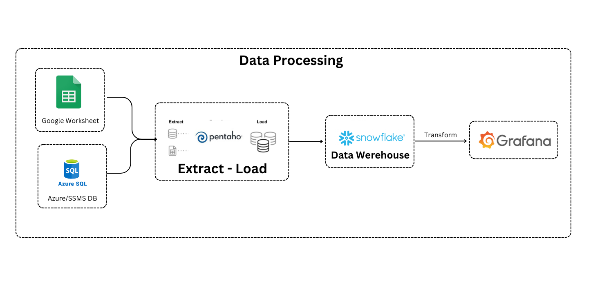
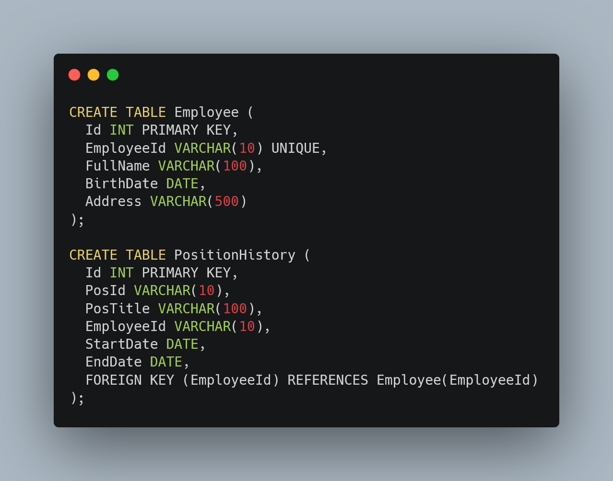
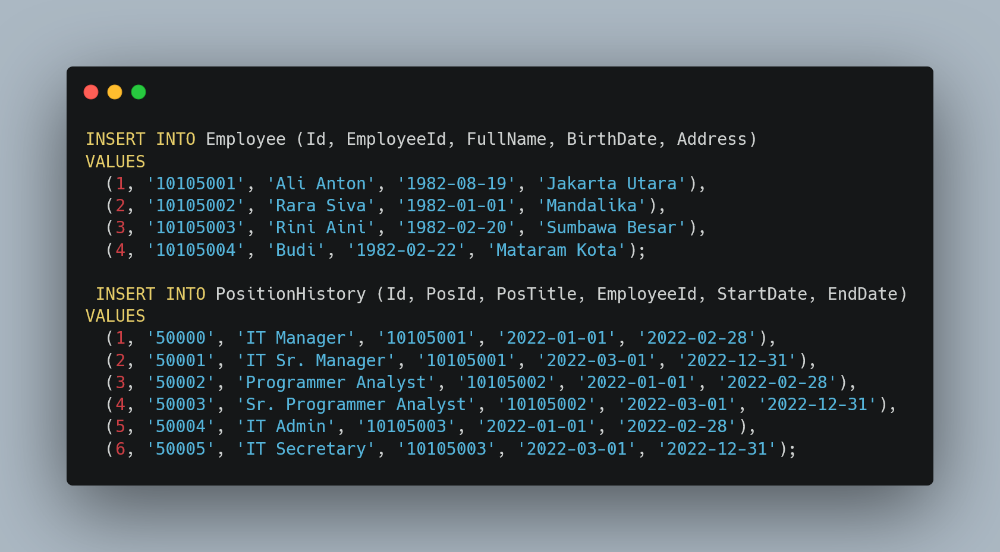
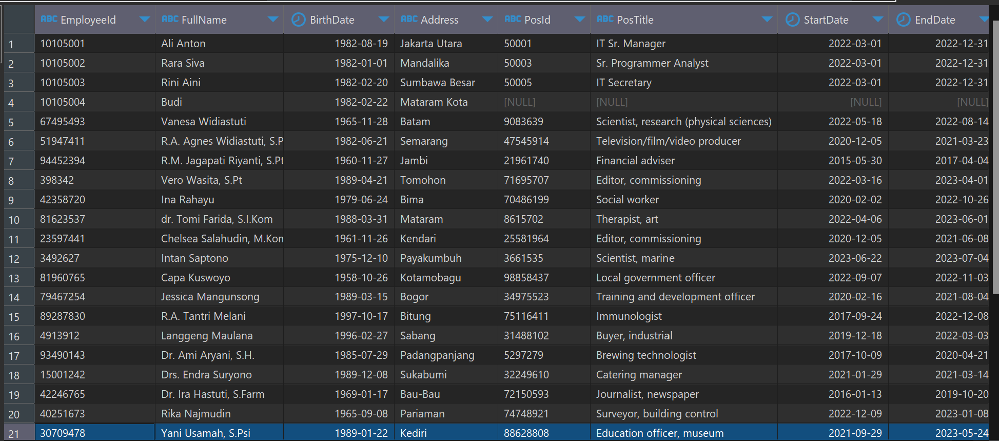
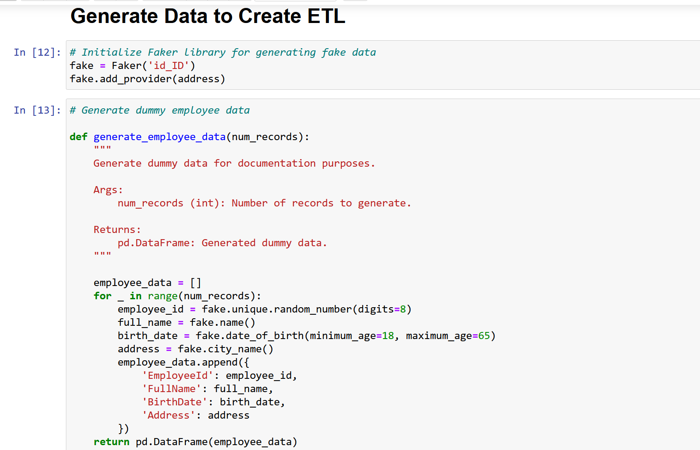
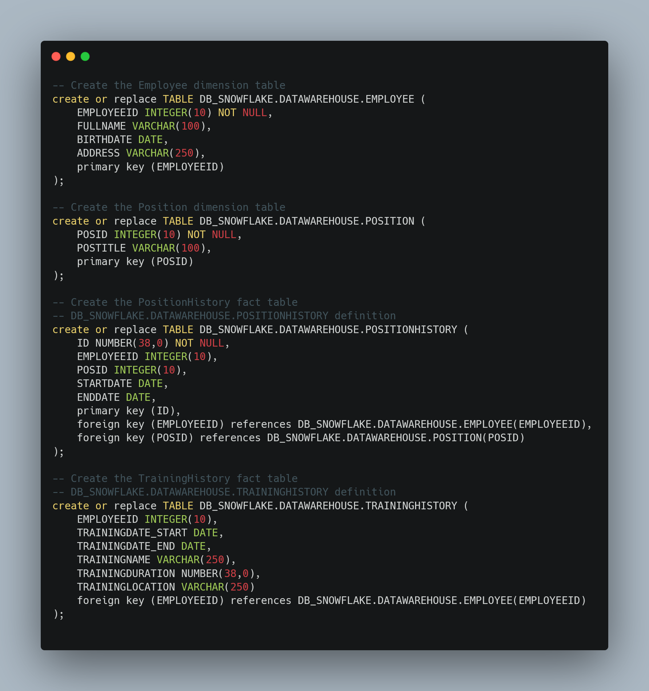
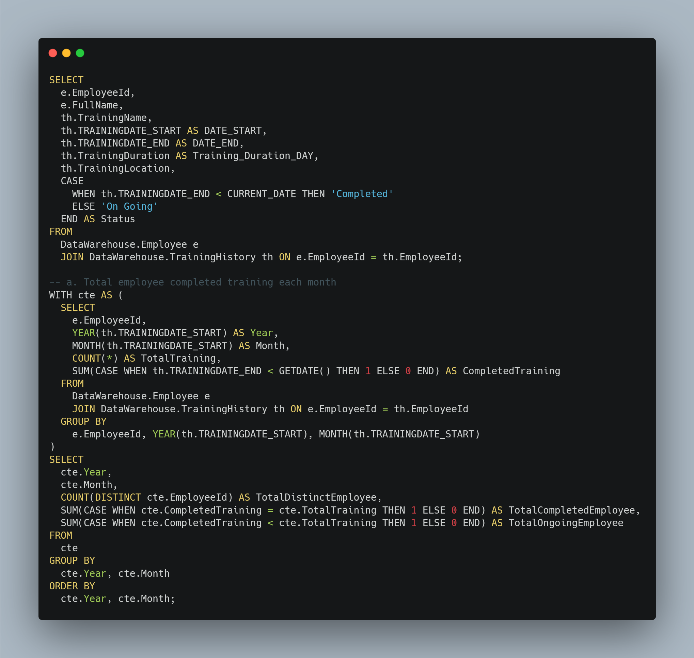
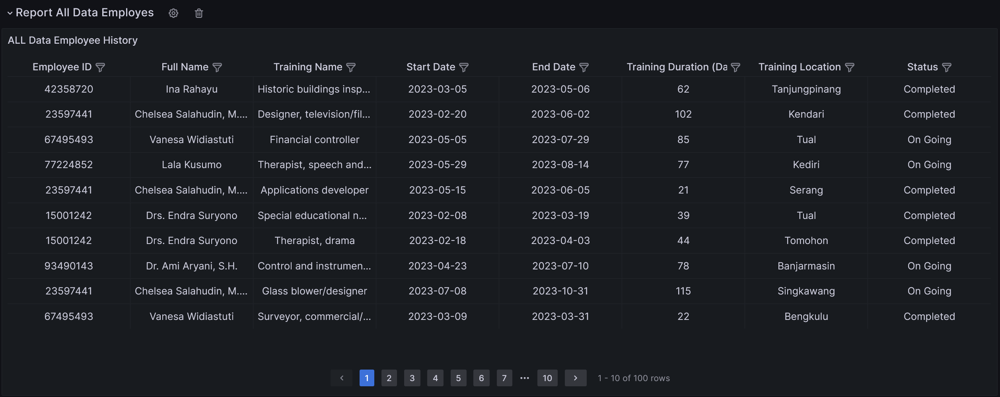

# Simple ETL - Visualization!
**This is Assessment Test**

  

<h1 align="center">Hi I am Rahmad Gunawan </h1>
<h3 align="center"> Simple ETL </h3>

By [Rahmad Gunawan](https://www.linkedin.com/in/ragunnn/)
## Dashboard

## Introduction

This repository contains scripts, notebooks, and queries to handle basic data operations for the Employee and PositionHistory objects. It includes scripts to create tables, insert data, and perform queries. Additionally, there is an IPython notebook (data_generation.ipynb) that generates fake data using Faker library and provides Python and SQL code for table creation and data insertion, allowing for seamless execution.

## Scripts

    - create_table.sql: This script contains SQL statements to create the necessary tables for each object.
    - insert_data.sql: This script contains SQL statements to insert sample data into the Employee and PositionHistory tables
    - query_employees.sql: This script contains a SQL query to retrieve all employee data with their current position information.

## Notebooks
Data_generation.ipynb: This notebook demonstrates how to generate fake data for the Employee and PositionHistory tables using the Faker library. It also includes Python and SQL code snippets for table creation and data insertion, providing a comprehensive guide for executing these operations.

## ETL, Data Warehouse, and Analytics Task

This section focuses on building a comprehensive ETL, Data Warehouse, and analytics system using Pentaho for ETL, Snowflake as the data warehouse, and Grafana for visualization.
Steps

    - Data Generation: The data_generation.ipynb notebook provides code to generate sample data using 
      the Faker library. Execute the notebook to generate realistic data for the Employee and PositionHistory 
      tables.
      
    - Table Creation and Data Insertion: Use the provided scripts or code snippets (create_insert_perform.sql) 
      to create the required tables and insert the generated sample data.
      
    - ETL with Pentaho: Utilize Pentaho to design and execute the ETL flow. Connect to the data sources 
      (Azure Employee data and GCP Training History), perform necessary transformations, and load the data 
      into the Snowflake data warehouse.
      
    - Data Warehouse: Set up Snowflake as the data warehouse to store and manage the compiled data from 
      the ETL process. Define appropriate schema and tables to accommodate the data.
      
    - Reporting: Design and create reports to display historical training data using the data available 
      in the Snowflake data warehouse. Utilize tools such as Pentaho Reporting or any other reporting 
      tool of your choice.
     
    - Visualization with Grafana: Connect Grafana to the Snowflake data warehouse and create dashboards to 
      visualize key metrics, such as the total number of employees who completed training each month and 
      the total number of training sessions held each month. Configure appropriate visualizations and 
      share insights from the data.

## Data and Query Task (Basic)

In this step, we need to create tables (Employee and PositionHistory) as the database source storage in Azure/SSMS. 
After creating the tables, we will proceed with the task of inserting sample data to verify the expected output. 
Below is the query to create the tables:

  

  
 

  

  
 

After creating and inserting the data, we need to create a query to display all employee data including 
their current position information. The desired columns are EmployeeId, FullName, BirthDate, Address, PosId, 
PosTitle, StartDate, and EndDate. and Here is the Output :

  

  
 

    - ** Note: If you want to execute this step, I have already provided a query to create the table, insert data, 
    and perform a basic query. Go to Script Folder -> run create_insert_perform.sql

## ETL, Data Warehouse and Analytics Task
After creating the data in Azure, we need to generate or create the Training History data. The Training History 
contains information about the training completed by employees, such as the start date, duration, and training name. 
To generate this data, we use the Faker library in Python to create dummy data. We provide the script in a Jupyter 
Notebook, and once we configure the dataset, we save it as a CSV file and upload it to a Google Worksheet.

  

  
 

Additionally, we provide additional data to enhance the Employee and PositionHistory tables. We use the Faker 
library to generate this dataset as well. Once the dataset is created, we proceed to extract the data from the 
storage and load it into the Data Warehouse using Snowflake.

## ETL using Pentaho
After setting up the database source, the next step is to load the dataset into the Data Warehouse. 
We create tables to store the data from the data source. Here is the script for creating the tables.

  

  
 

 Once the tables are set up, we move on to setting up the data extraction and loading process using Pentaho 
 as the ETL (Extract, Transform, Load) tool. We configure Pentaho to connect to the database sources, 
 including Google Worksheet and Azure, as well as to the Snowflake Data Warehouse. Here is an example of 
 a simple Extract and Load process to the Snowflake Data Warehouse.

  

  
 

 With the data compiled into the Data Warehouse, the next step is to design a simple report that displays 
 historical training data. Additionally, we create a simple dashboard that shows the total number of employees
  who completed training each month and the total number of trainings conducted each month.

  

  
 

Sample Analytical Query

      - ** Note: If you wish to execute this step, I have provided the necessary scripts, 
      including dwh_table.sql for table creation, extract_load_dwh.ktr for the Pentaho ETL process, 
      and query_analytical.sql for analytical queries. 

## Project Results - Grafana Dashboard
Below are a few sample screenshots showcasing the results of the project:
    
    Report  Historical Training Employee
  

  
 

    Dashboard in Grafana displaying the total number of employees who completed training each month.

  

  
 

With the provided scripts, notebooks, and steps, you can replicate and customize this project to suit your specific requirements. Enjoy exploring and analyzing your data!

## Here's how to use the program:
Let's dive into the exciting world of data!

    - Start by downloading all the script files and modules into a local directory. 
      Make sure you have everything you need to unleash the power of your data.

    - Get ready to ignite the database engine! Run the datasource script SQL file and 
      feel the adrenaline rush as you set up the perfect  database environment.

    - Time to generate some data magic! Open the Jupyter Notebook and watch as the code weaves its spell, 
      creating meaningful and insightful data just for you.

    - But wait, we're not done yet! Enter Pentaho, the master of data extraction and loading. Execute 
      the "extract_load_dwh.ktr" file and let it work its magic, transforming raw data into a powerful force.

    - Now it's time to unveil the hidden gems within your data. Run the SQL script and witness the birth 
      of analytical insights. Prepare to be amazed as patterns emerge and trends reveal themselves.

    - Visualize your data in style! Set up Grafana, your gateway to stunning and interactive dashboards. 
      Connect it to your data source, and watch as your data comes to life in vibrant charts and graphs.

    - Take a moment to savor the journey. Enjoy the thrill of exploring your data, gaining new insights, 
      and making informed decisions. Let your imagination soar as you uncover hidden opportunities and 
      unleash the full potential of your data.

Get ready to embark on a data-driven adventure like no other. The stage is set, the scripts are in place. It's time to make your data dance to your tune. Let the excitement begin!

## Developed By
1. [Rahmad Gunawan, Linkedin (Link)](https://www.linkedin.com/in/ragunnn/)

      This is the result of my work, but I believe there is still room for improvement in this project. If you have any suggestions or would like to connect with me, feel free to do so. I greatly appreciate you taking the time to review my work. Together, we can create something even better!

  
  

